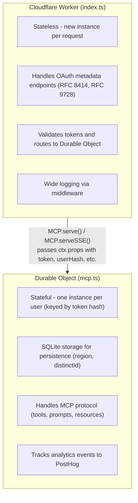
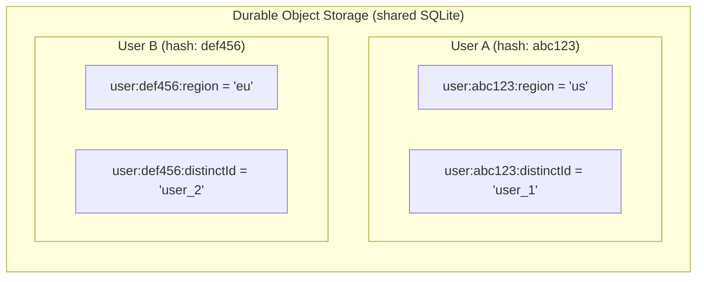
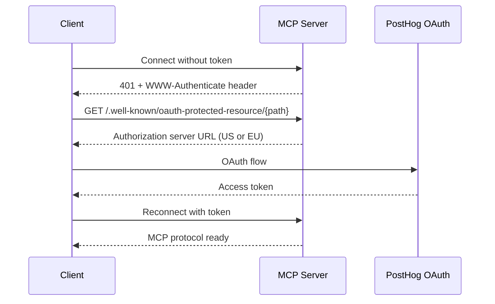

# MCP Integration Architecture

This directory contains the Cloudflare Workers implementation of PostHog's MCP (Model Context Protocol) server.

## Overview

The implementation uses two Cloudflare primitives:

1. **Worker** (`index.ts`) - Stateless request router
2. **Durable Object** (`mcp.ts`) - Stateful MCP protocol handler


```mermaid
flowchart TB
    subgraph Worker["Cloudflare Worker (index.ts)"]
        W1["Stateless - new instance per request"]
        W2["Handles OAuth metadata endpoints (RFC 8414, RFC 9728)"]
        W3["Validates tokens and routes to Durable Object"]
        W4["Wide logging via middleware"]
    end

    subgraph DO["Durable Object (mcp.ts)"]
        D1["Stateful - one instance per user (keyed by token hash)"]
        D2["SQLite storage for persistence (region, distinctId)"]
        D3["Handles MCP protocol (tools, prompts, resources)"]
        D4["Tracks analytics events to PostHog"]
    end

    Worker -->|"MCP.serve() / MCP.serveSSE()<br/>passes ctx.props with token, userHash, etc."| DO
```

## File Structure

```txt
src/integrations/mcp/
├── index.ts          # Worker entry point and request router
├── mcp.ts            # Durable Object class (MCP protocol handler)
├── README.md         # This file
└── utils/
    ├── client.ts     # PostHog analytics client
    ├── formatResponse.ts
    ├── handleToolError.ts
    └── logging.ts    # Wide logging middleware
```

## Key Concepts

### Worker → Durable Object Communication

The Worker passes request context to the Durable Object via `ctx.props`:

```typescript
// In Worker (index.ts)
Object.assign(ctx.props, {
  apiToken: token,
  userHash: hash(token),
  sessionId: sessionId,
  features: features,
  region: regionParam,
})

// Then route to Durable Object
MCP.serve('/mcp').fetch(request, env, ctx)
```

The Durable Object accesses this via `this.props`:

```typescript
// In Durable Object (mcp.ts)
get requestProperties(): RequestProperties {
    return this.props as RequestProperties
}
```

### Per-User State via Durable Objects

Durable Objects provide a single shared SQLite storage instance (`this.ctx.storage`). To achieve per-user isolation within this shared storage, we use a **namespaced key pattern**:


```mermaid
flowchart LR
    subgraph Storage["Durable Object Storage (shared SQLite)"]
        subgraph UserA["User A (hash: abc123)"]
            A1["user:abc123:region = 'us'"]
            A2["user:abc123:distinctId = 'user_1'"]
        end
        subgraph UserB["User B (hash: def456)"]
            B1["user:def456:region = 'eu'"]
            B2["user:def456:distinctId = 'user_2'"]
        end
    end
```

The `DurableObjectCache` handles this namespacing automatically:

```typescript
// In DurableObjectCache (src/lib/cache/DurableObjectCache.ts)
private getScopedKey(key: string): string {
    return `user:${this.userHash}:${key}`
}

// When mcp.ts calls:
await this.cache.set('region', 'us')

// It actually stores:
await this.storage.put('user:abc123:region', 'us')
```

The `userHash` is a PBKDF2 hash of the API token (see `src/lib/utils/helper-functions.ts`), ensuring:

- **Isolation**: Users can't access each other's cached data (different prefix)
- **Persistence**: Region and distinctId survive across requests
- **Deterministic**: Same token always produces the same hash/prefix
- **Secure**: Tokens can't be reversed from the hash

### Wide Logging Pattern

Instead of scattered log statements, we accumulate data into a single log object and emit once at the end:

```typescript
const log = new RequestLogger()
log.extend({ route: url.pathname })
log.extend({ region: effectiveRegion })
// ... handle request ...
log.emit(response.status) // Single log with all data + duration
```

This produces one structured JSON log per request, making it easier to query in observability tools.

### Tracking and observability

There are three independent layers that emit signals about each MCP request:

1. **PostHog analytics events** — `mcp_tool_call` and friends, captured for product analytics.
2. **Outbound API headers** — propagated when the MCP server calls PostHog's Django backend, so backend log lines and OTLP spans can correlate with the originating MCP request.
3. **Wide structured logs** — single JSON record per request from the Worker itself (see [Wide Logging Pattern](#wide-logging-pattern) above).

#### `mcp_tool_call` event paths

Three distinct code paths emit `mcp_tool_call` events; which one fires depends on the server mode and on the `mcp-posthog-analytics-sdk` feature flag:

- **`mcp.ts:trackEvent`** — homegrown PostHog capture. Used by the exec-mode wrapper to emit events for inner tool calls. Properties use the bare form: `mcp_session_id`, `mcp_conversation_id`, `mcp_client_name`, etc.
- **`lib/mcpcat.ts`** — legacy MCPcat SDK path. Same bare property names.
- **`lib/posthog-mcp-analytics.ts`** — the [`@posthog/mcp-analytics`](https://github.com/PostHog/mcp-analytics) SDK. Property names are `$`-prefixed (`$mcp_session_id`, `$mcp_conversation_id`, …). This is the path most live traffic flows through today.

Adding a new property to events means wiring it into the `McpCatIdentityProvider` interface and the property-builder in **all three** emitters, then sourcing the value on `requestProperties` (or pulling it from another DO-level source).

#### Three correlation identifiers

Three identifiers travel with each request, each with a different lifecycle and a different consumer:

| Identifier                                          | Source                                                                                                                                                                                                                                                                                     | Where it lands                                                                                                                                                                                                             |
| --------------------------------------------------- | ------------------------------------------------------------------------------------------------------------------------------------------------------------------------------------------------------------------------------------------------------------------------------------------ | -------------------------------------------------------------------------------------------------------------------------------------------------------------------------------------------------------------------------- |
| **`sessionId`** (wrapper-app hint)                  | `?sessionId=` query param, set by integrators (setup wizard, sandbox, etc.)                                                                                                                                                                                                                | Resolved to a UUIDv7 via `SessionManager.getSessionUuid()` and stamped as `$session_id` / `$ai_session_id` on events — drives Session Replay and LLM Analytics grouping. Only set when a wrapper supplies it.              |
| **`mcpSessionId`** (transport session)              | `Mcp-Session-Id` HTTP header, server-minted on initialize per the [Streamable-HTTP MCP spec](https://modelcontextprotocol.io/specification/2025-06-18/basic/transports#streamable-http) and echoed by clients on every subsequent request                                                  | Stamped on `mcp_tool_call` events as `mcp_session_id` / `$mcp_session_id`, and forwarded to Django as `X-Posthog-Mcp-Session-Id` so backend structlog contextvars + OTLP span attributes (`mcp.session_id`) can correlate. |
| **`mcpConversationId`** (agent-echoed conversation) | The `conversation_id` arg [injected into tool schemas](https://github.com/PostHog/mcp-analytics/pull/14) by `@posthog/mcp-analytics` when `enableConversationId: true`. The SDK mints a UUID and asks the agent to echo it on subsequent calls, so it persists across transport reconnects | Same plumbing as `mcpSessionId` — stamped on events and forwarded to Django as `X-Posthog-Mcp-Conversation-Id`.                                                                                                            |

Crucially, **`sessionId` and `mcpSessionId` are different concepts** and will not match for the same request. The wrapper-app `sessionId` is only set for a small fraction of traffic (mostly integrator-driven flows); the transport `mcpSessionId` is on essentially every authenticated request after initialize.

#### Forwarding session and conversation IDs to Django

When the Worker calls PostHog's Django backend (any `ApiClient.fetch`), the outbound request carries:

- `X-Posthog-Mcp-Session-Id: <mcpSessionId>` — when set on `ApiClient.config`
- `X-Posthog-Mcp-Conversation-Id: <mcpConversationId>` — when set on `ApiClient.config`

On the Django side, `per_request_logging_context_middleware` reads both headers (sanitized through the existing `sanitize_header_value` helper), binds them to structlog contextvars (`mcp_session_id`, `mcp_conversation_id`), and sets them on the current OTLP span as `mcp.session_id` / `mcp.conversation_id`.

The headers are caller-asserted — anyone can spoof them on a request — so backend consumers should treat them as correlation hints, not authoritative identifiers.

This is **attribute-based correlation, not distributed-trace span linkage** — the Worker emits no OTLP itself and forwards no `traceparent`, so the Django-rooted span is not a child of any Worker-side span. Tracing backends can correlate after the fact by querying on the attribute, but won't render a cross-service trace tree until Worker-side OTLP export ships.

### Durable Object cold vs warm

Cloudflare Durable Objects have two lifecycle states that matter when reasoning about cached state in this codebase:

- **Cold start.** A request arrives, no live DO instance exists. The Cloudflare runtime constructs a fresh instance and calls `init()`. `_api`, `_cache`, and any other lazily-initialized fields are built from scratch. The DO is now "warm".
- **Warm.** Subsequent requests reuse the same in-memory DO instance. `init()` does **not** re-run; cached fields (`_api`, `_cache`) keep the values captured on the cold start. Per-request props arrive via the framework's `updateProps` / `setName` ingress (which `McpAgent` overrides).
- **Hibernation.** After ~10 s of inactivity, the runtime tears the DO down. The next request triggers a fresh cold start. DO storage (`this.ctx.storage`) persists across hibernation; in-memory caches do not.

This matters for any value that's per-request but ends up snapshotted onto a long-lived cached object:

- The cached `_api` is built once in `api()`, during `init()` on the cold start. The cold start's request is almost always an **initialize** call, which by spec does **not** carry the `Mcp-Session-Id` header (the server is about to mint it in the response). So `_api.config.mcpSessionId` is `undefined` at construction and stays that way for the warm DO's lifetime.
- For values that need to refresh per request, mutate `_api.config` in place from `updateProps` / `setName` (the per-request ingress hooks). That's what `rotateCachedApiToken` does for `apiToken`.
- Event emission is unaffected by this caching: `trackEvent` reads `this.requestProperties.mcpSessionId` directly per emission, and the `posthog-mcp-analytics` SDK reads `extra.sessionId` from the transport per event. So `mcp_session_id` lands on events even when `_api`'s copy is stale.

## OAuth Flow

The server implements RFC 9728 (OAuth Protected Resource Metadata) and RFC 8414 (OAuth Authorization Server Metadata):


```mermaid
sequenceDiagram
    participant Client
    participant MCP as MCP Server
    participant PostHog as PostHog OAuth

    Client->>MCP: Connect without token
    MCP-->>Client: 401 + WWW-Authenticate header
    Client->>MCP: GET /.well-known/oauth-protected-resource/{path}
    MCP-->>Client: Authorization server URL (US or EU)
    Client->>PostHog: OAuth flow
    PostHog-->>Client: Access token
    Client->>MCP: Reconnect with token
    MCP-->>Client: MCP protocol ready
```

## Wrangler Configuration

The Durable Object binding is configured in `wrangler.jsonc`:

```jsonc
{
  "durable_objects": {
    "bindings": [
      {
        "class_name": "MCP",
        "name": "MCP_OBJECT",
      },
    ],
  },
  "migrations": [
    { "new_sqlite_classes": ["MyMCP"], "tag": "v1" },
    { "renamed_classes": [{ "from": "MyMCP", "to": "MCP" }], "tag": "v2" },
  ],
}
```

The `MCP` class must be exported from the Worker entry point for Wrangler to find it.
