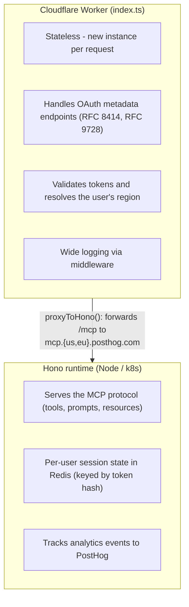
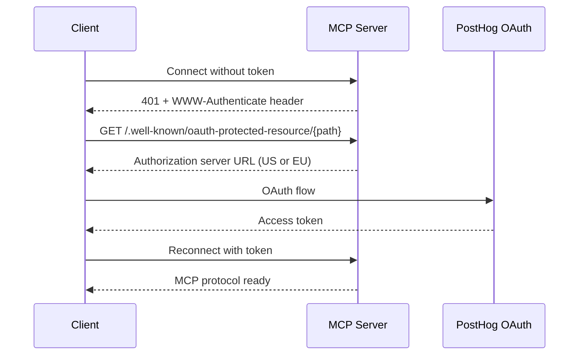

# MCP Integration Architecture

This directory contains PostHog's MCP (Model Context Protocol) server. The protocol is served by the **Hono runtime** (Node, deployed to our k8s clusters). A thin **Cloudflare Worker** sits in front of it as a stateless edge router that terminates OAuth, validates tokens, and proxies `/mcp` traffic to the regional Hono deployment.

## Overview


```mermaid
flowchart TB
    subgraph Worker["Cloudflare Worker (index.ts)"]
        W1["Stateless - new instance per request"]
        W2["Handles OAuth metadata endpoints (RFC 8414, RFC 9728)"]
        W3["Validates tokens and resolves the user's region"]
        W4["Wide logging via middleware"]
    end

    subgraph Hono["Hono runtime (Node / k8s)"]
        H1["Serves the MCP protocol (tools, prompts, resources)"]
        H2["Per-user session state in Redis (keyed by token hash)"]
        H3["Tracks analytics events to PostHog"]
    end

    Worker -->|"proxyToHono(): forwards /mcp to<br/>mcp.{us,eu}.posthog.com"| Hono
```

The Worker no longer serves the protocol itself — an earlier iteration ran a stateful Cloudflare Durable Object (`mcp.ts`) for this, but that has been removed in favor of always proxying to Hono.

### Protocol dialects: legacy stateful and 2026-07-28 stateless

The Hono dispatcher serves both MCP dialects side by side (`src/lib/stateless-protocol.ts` holds the shared constants):

- **Legacy (≤2025-11-25)**: the `initialize` handshake negotiates a protocol version, the server mints an `Mcp-Session-Id`, and clients echo it on subsequent requests. Unchanged wire shape.
- **Stateless (2026-07-28, SEP-2575)**: no handshake and no protocol-level sessions. Each request self-describes via reserved `_meta` keys (`io.modelcontextprotocol/protocolVersion`, `.../clientInfo`, `.../clientCapabilities` — the first is the dialect switch, all three are mandatory and missing ones are rejected with `-32602` + HTTP 400); capability discovery happens through the mandatory `server/discover` RPC (capabilities + `serverInfo` + instructions + `supportedVersions`). Results carry `resultType: "complete"`, the server's identity in `_meta` (`io.modelcontextprotocol/serverInfo`), and — for `CacheableResult` methods (`server/discover`, `tools/list`, `resources/list`, `resources/read`, `prompts/list`) — `ttlMs`/`cacheScope: "private"` freshness hints. The TTL is nonzero in production only — locally `ttlMs: 0` (the spec-compliant "don't cache") keeps SDK client response caches from serving stale results while iterating on tool definitions.

A request's dialect is detected per request from the `_meta` protocol-version key or a modern `MCP-Protocol-Version` header. Only modern versions (2026-07-28+) are valid there — legacy versions are implemented solely behind the `initialize` handshake, so `server/discover` advertises modern versions only, and a legacy or unknown `_meta` version is rejected with `UnsupportedProtocolVersionError` (`-32022` on HTTP 400, with the spec's machine-readable `data.supported`/`data.requested` payload). Modern requests must also carry SEP-2243's operation headers — `MCP-Protocol-Version` (mirroring `_meta`), `Mcp-Method` (mirroring the body `method`), and `Mcp-Name` (mirroring `params.name`/`params.uri` on `tools/call`, `prompts/get`, `resources/read`) — so intermediaries can route without parsing bodies; a missing or contradicting header is rejected with `HeaderMismatch` (`-32020`) + HTTP 400 before dispatch. Modern messages are also barred from JSON-RPC arrays (`-32600` + 400; batching was removed from the protocol in 2025-06-18), and RPCs the modern dialect removed (`initialize`, `ping`) answer method-not-found on HTTP 404. Legacy clients are untouched by all of this: header-free requests — including ones sending a legacy `MCP-Protocol-Version` value such as `2025-06-18` — keep the exact pre-existing wire behavior (HTTP 200 with errors in the JSON-RPC body). Client identity for analytics is read from the `initialize` body for legacy clients and from per-request `_meta` for stateless clients. Stateless requests never mint or echo `Mcp-Session-Id` — cross-request correlation for that traffic relies on `mcpConversationId` (see below).

## File Structure

```txt
src/
├── index.ts          # Worker entry point: OAuth, routing, /mcp proxy
├── proxy.ts          # Region resolution + reverse proxy to the Hono runtime
├── hono/             # The Hono runtime that actually serves the MCP protocol
└── lib/              # Shared helpers (caching, analytics, logging, …)
```

## Key Concepts

### Worker → Hono communication

The Worker resolves the caller's region (from cache/KV or by probing both regions) and reverse-proxies the request to the matching Hono deployment:

```typescript
// In Worker (index.ts)
if (url.pathname.startsWith('/mcp')) {
  const region = await resolveProxyRegion(token, ctx.props.userHash, env.MCP_KV)
  return proxyToHono(request, region)
}
```

`RequestProperties` (the parsed headers and query params for a request) is defined in `src/lib/request-properties.ts` and shared by both runtimes.

### Per-User State

The Hono runtime keeps per-user session state (active project/organization, region, distinctId) in Redis, namespaced by `userHash` — a PBKDF2 hash of the API token (see `src/lib/utils`), ensuring:

- **Isolation**: Users can't access each other's cached data (different prefix)
- **Persistence**: Region and distinctId survive across requests
- **Deterministic**: Same token always produces the same hash/prefix
- **Secure**: Tokens can't be reversed from the hash

### Wide Logging Pattern

Instead of scattered log statements, we accumulate data into a single log object and emit once at the end:

```typescript
const log = new RequestLogger()
log.extend({ route: url.pathname })
log.extend({ region: effectiveRegion })
// ... handle request ...
log.emit(response.status) // Single log with all data + duration
```

This produces one structured JSON log per request, making it easier to query in observability tools.

### Tracking and observability

Three layers describe each MCP request.
They have different owners and uses.

| Signal               | Owner                                        | Use                                                                          |
| -------------------- | -------------------------------------------- | ---------------------------------------------------------------------------- |
| MCP Analytics events | `PostHogMCP` through `src/hono/analytics.ts` | Product analytics for tool use, intent, model, errors, and discovery         |
| Outbound API headers | `ApiClient.fetch()`                          | Context for Django analytics, activity logs, structured logs, and OTLP spans |
| Wide structured logs | The Worker `RequestLogger`                   | One redacted edge log for the HTTP request                                   |

#### MCP Analytics SDK boundary

The public [event and property reference](https://posthog.com/docs/mcp-analytics/events) owns the shared wire contract.
The [custom server integration guide](https://posthog.com/docs/mcp-analytics/custom-servers) owns the `PostHogMCP` API contract for custom dispatchers.
This file only documents how the PostHog server connects those contracts to its request context.

The server uses one shared `PostHogMCP` client from `src/lib/posthog/client.ts`.
`ToolExecutor` uses `prepareToolList()` and `prepareToolCall()` to add and remove SDK-owned intent and model fields.
`src/hono/analytics.ts` calls the SDK capture methods for initialization, tool calls, tool listings, missing capabilities, and feedback.
Direct tool calls and inner exec calls use the same `trackToolCall()` path.
The SDK builds the canonical `$mcp_*` fields and applies its sanitization and truncation rules.

This server emits `$mcp_initialize` from both the legacy `initialize` handshake and modern `server/discover`.
Modern requests do not have an `initialize` handshake.

The server keeps existing server-specific `$mcp_*` properties for compatibility.
Do not add new `$mcp_*` names in this server.
Add a shared signal to the SDK and the [event reference](https://posthog.com/docs/mcp-analytics/events), after agreement with the MCP Analytics team.
Use an unreserved name for local metadata.

#### Identity, correlation, and provenance

Do not treat these values as one session identifier.
Each value has a separate source and lifecycle.

| Signal                 | How this server resolves it                                                                                                                                                   | Event output and use                                                                                                                      |
| ---------------------- | ----------------------------------------------------------------------------------------------------------------------------------------------------------------------------- | ----------------------------------------------------------------------------------------------------------------------------------------- |
| Protocol revision      | Legacy clients send it during `initialize`. Modern clients send `io.modelcontextprotocol/protocolVersion` and `MCP-Protocol-Version` on each request.                         | `$mcp_protocol_version`. The value is request-scoped for the 2026-07-28 revision.                                                         |
| Client identity        | Legacy clients send `clientInfo` during `initialize`. Modern clients send it in request `_meta`. A missing live field can use the value pinned to a legacy transport session. | `$mcp_client_name` and `$mcp_client_version`. The API client also forwards them to Django.                                                |
| Vendor and user agent  | HTTP headers provide `User-Agent` and `x-anthropic-client`. The server sanitizes both at the boundary.                                                                        | `$mcp_client_user_agent` and `$mcp_vendor_client`. Queries resolve the final harness label from these values and the client name.         |
| Model and model source | `prepareToolCall()` checks recognized request metadata first. It uses the SDK-owned `llm_model` tool argument as a fallback.                                                  | `$mcp_llm_model` and `$mcp_llm_model_source`. The source is `client_metadata` or `self_reported`.                                         |
| Intent                 | `prepareToolCall()` reads the SDK-owned `context` tool argument and removes it before dispatch.                                                                               | `$mcp_intent` and `$mcp_intent_source`. The API client also forwards intent for activity logs.                                            |
| Transport session      | Legacy `initialize` creates an `Mcp-Session-Id`. Clients echo it on later requests. Modern 2026-07-28 requests have no protocol session.                                      | `$mcp_session_id`. The server also uses it for legacy session-scoped state and downstream correlation.                                    |
| Conversation handle    | This custom server reads the optional `mcp-conversation-id` request header. It does not mint or verify the handle.                                                            | `$mcp_conversation_id`. The value can correlate requests across transport sessions, but it does not set `$session_id`.                    |
| Analytics session      | `getEffectiveSessionUuid()` uses `?sessionId=` first, then the legacy `Mcp-Session-Id`. `SessionManager` maps the selected value to a UUIDv7.                                 | `$session_id`, which MCP Analytics uses for session grouping. It can be absent on modern requests when no wrapper supplies `?sessionId=`. |

The generic `instrument()` SDK path enables conversation IDs by default.
It can mint a conversation handle and derive `$session_id` after the agent echoes that handle.
This server uses the custom `PostHogMCP` path, which does not provide that conversation flow.
The inbound conversation header does not take part in this server's `$session_id` resolution.

#### Django propagation and trace correlation

`ApiClient.fetch()` forwards the original user agent, client name and version, protocol version, consumer, OAuth client name, transport session, conversation handle, and intent.
The backend uses the client fields for request analytics and the intent for activity logs.

`per_request_logging_context_middleware` reads the session and conversation headers.
It binds them to the `mcp_session_id` and `mcp_conversation_id` structlog context variables.
It also adds `mcp.session_id` and `mcp.conversation_id` to the current OTLP span.

This is attribute-based correlation.
The Worker does not emit OTLP and the server does not forward `traceparent`, so Django starts a separate trace.

#### Trust and privacy

Client identity, vendor identity, model identity, and correlation headers are caller-provided.
Use them for analytics and diagnostics, not for authorization, billing, or other security decisions.

The SDK applies payload redaction and truncation before capture.
Read the [privacy and redaction guide](https://posthog.com/docs/mcp-analytics/privacy) before you add payload data.
Analytics failures must not fail an MCP request.

## OAuth Flow

The server implements RFC 9728 (OAuth Protected Resource Metadata) and RFC 8414 (OAuth Authorization Server Metadata):


```mermaid
sequenceDiagram
    participant Client
    participant MCP as MCP Server
    participant PostHog as PostHog OAuth

    Client->>MCP: Connect without token
    MCP-->>Client: 401 + WWW-Authenticate header
    Client->>MCP: GET /.well-known/oauth-protected-resource/{path}
    MCP-->>Client: Authorization server URL (US or EU)
    Client->>PostHog: OAuth flow
    PostHog-->>Client: Access token
    Client->>MCP: Reconnect with token
    MCP-->>Client: MCP protocol ready
```

## Wrangler Configuration

The Worker no longer binds a Durable Object — `/mcp` is proxied to the Hono runtime. The historical DO migrations remain in `wrangler.jsonc` as tombstones, with a final `deleted_classes` migration that retires the class (and its per-user SQLite storage) in Cloudflare:

```jsonc
{
  "migrations": [
    { "new_sqlite_classes": ["MyMCP"], "tag": "v1" },
    { "renamed_classes": [{ "from": "MyMCP", "to": "MCP" }], "tag": "v2" },
    { "deleted_classes": ["MCP"], "tag": "v3" },
  ],
}
```
