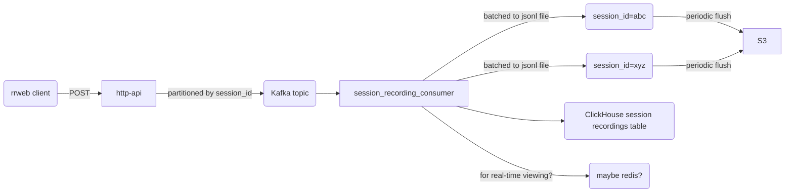

# Session Recordings persistence

Responsible for writing Session Recordings from the main event ingestion topic
into S3 (or compatible) for persistence, as well as exposing recordings via an
HTTP API.

## Drivers

Session recordings have become a popular feature. Historically we have handled
the data emitted from rrweb via the same path as analytics events before forking
from that code flow to push into a ClickHouse `session_recording_events` table
instead of the `events` table. This offers querying events by `session_id`
ordered by event timestamp.

Managing ClcikHouse is however not simple, takes resources away from Analytics
queries, and requires expensive SSDs to ensure merges are able to keep up. We
want to simplify management of Session Recordings.

We also have requests for storing session recording for longer periods, so we
want to make it cheaper to store session recordings.

## Requirements

1. Must allow clients to persist rrweb session recording events.
1. Must allow customers to retrieve all events for a specific rrweb recording
   session.
1. Should fail gracefully if session recording events are lost e.g. failures in
   the clients network connection.
1. Must be able to list recordings for a specific team, filtered by the existing
   options we have in the PostHog app.

## Non-requirements

1. Providing immediate playback of session recordings. Playback is useful for
   debugging purposes, but I'm explicitly leaving that as a separate task. This
   could involve either something similar to the [real time events view
   proposal](https://github.com/PostHog/product-internal/pull/407), pushing to a
   temporary store e.g. Redis etc. or some other solution. But I'm leaving it
   specifically as an improvement.

## Constraints

1. Processes will fail so we need to handle this case.
1. We deploy regularly, and deploys wait for a 120 second grace period before
   killing running processes hard.
1. Sessions last a max of 6 hours.
1. A single session recording originates from a single browser, so the limits
   for one session recordings are what a reasonable user on a sensibly
   constructed website would produce. What reasonable means here is up for
   debate, but, for instance I would expect a maximum of 10 full snapshot
   session recordings and 10 mutations per second. These are not solid, but we
   can sure them up by looking at existing data. The main point is that we
   should identify what is reasonable such that we can focus on these cases, and
   make compromises if needed on others.

## Design

NOTE: this is being typed up very much after the fact, details may differ from
the existing implementation.

Firstly, looking at the require query patterns we need to play a recording, at
it's simplest we would, given a `session_id` we would retrieve the whole session
recording and play this back with the rrweb player. The size of these recordings
however can be large, so we should to provide some method of ensuring that the
response size is bounded.

TODO: fill out reasoning

Assume that we are to persist session recordings in at minimum 10 minute blobs,
on the write path per session we would end up with 36 S3 blob posts for a 6 hour
recording. Current S3 costs are:

    $0.005 per 1000 requests

Which means at worst we will have roughly $0.005 per 27 (= 1000 / 36) sessions.
Looking at the average for Friday, 2023-01-20 we actually have on average 2 ten
minute periods per session recording, which gives $0.005 per 500 (=1000 / 2)
sessions. That translates to **$10 per 1 million recordings** for the PUTs.

Session recordings, at least as they are defined currently give around 450GB per
million session recordings, which is ~$0.022 per gig which gives **~$10 per
million session recordings**. So that's

    $20 per 1 million recordings on average

## Components



Ingester - reads off of the event ingestion topic, filtering down to only the
`$snapshot` events, partitioning these by `(team_id, session_id, window_id)` and
writing these as chunks to S3.

API - given a `(team_id, session_id)` pair, returns the corresponding events as
a paginated list.

## Dependencies

The keep complexity down, we are only dependent on Kafka and MinIO.

## Development

To get up and running with tests, have the following commands running:

```bash
docker-compose up
yarn start
yarn test
```
