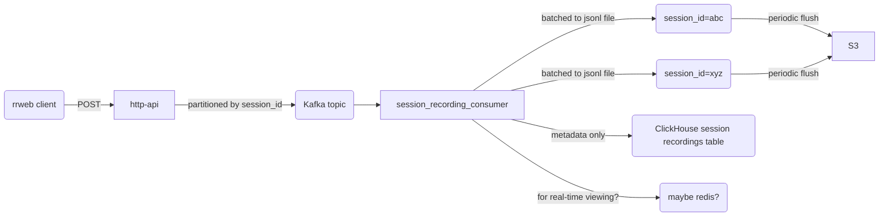

# Session Recordings persistence

Responsible for writing Session Recordings from the main event ingestion topic
into S3 (or compatible) for persistence, as well as exposing recordings via an
HTTP API.

## Drivers

Session recordings have become a popular feature. Historically we have handled
the data emitted from rrweb via the same path as analytics events before forking
from that code flow to push into a ClickHouse `session_recording_events` table
instead of the `events` table. This offers querying events by `session_id`
ordered by event timestamp.

Managing ClcikHouse is however not simple, takes resources away from Analytics
queries, and requires expensive SSDs to ensure merges are able to keep up. We
want to simplify management of Session Recordings.

We also have requests for storing session recording for longer periods, so we
want to make it cheaper to store session recordings.

## Requirements

1. Must allow clients to persist rrweb session recording events.
1. Must allow customers to retrieve all events for a specific rrweb recording
   session.
1. Should fail gracefully if session recording events are lost e.g. failures in
   the clients network connection.
1. Must be able to list recordings for a specific team, filtered by the existing
   options we have in the PostHog app.

## Non-requirements

1. Providing immediate playback of session recordings. Playback is useful for
   debugging purposes, but I'm explicitly leaving that as a separate task. This
   could involve either something similar to the [real time events view
   proposal](https://github.com/PostHog/product-internal/pull/407), pushing to a
   temporary store e.g. Redis etc. or some other solution. But I'm leaving it
   specifically as an improvement.

## Constraints

1. Processes will fail so we need to handle this case.
1. We deploy regularly, and deploys wait for a 120 second grace period before
   killing running processes hard.
1. Sessions last a max of 6 hours.
1. A single session recording originates from a single browser, so the limits
   for one session recordings are what a reasonable user on a sensibly
   constructed website would produce. What reasonable means here is up for
   debate, but, for instance I would expect a maximum of 10 full snapshot
   session recordings and 10 mutations per second. These are not solid, but we
   can sure them up by looking at existing data. The main point is that we
   should identify what is reasonable such that we can focus on these cases, and
   make compromises if needed on others.

## Design

NOTE: this is being typed up very much after the fact, details may differ from
the existing implementation.

Firstly, looking at the require query patterns we need to play a recording, at
it's simplest we would, given a `session_id` we would retrieve the whole session
recording and play this back with the rrweb player. The size of these recordings
however can be large, so we should to provide some method of ensuring that the
response size is bounded.

Before we can play back a recording, we want to first sort the events within the
rrweb recording in order of the sequence of mutations. There is no other sorting
we need to perform on the data. If we filter the events then we are left with an
incomplete recording. So I posit that there is only one representation of this
data that we need, and so the simplest solution on the querying side is to have
already persisted the data in the ideal format, as a blob.

How can we achieve in order processing of rrweb events? There are likely other
ways to do this, but the simplest with our setup would be to:

1.  ensure that the rrweb/posthog-js client only tries to persist events after
    if has had confirmation the the event immediately before it has already been
    persisted. We need to ensure that HTTP 200 really does mean the we have
    persisted.
1.  persist all events from the same session to the same Kafka topic.

With these points we should then essentially have a single in order log of the
rrweb events for a session, which is the result that we would want to return for
a query on `session_id`. We now need to make this queryable by the client. We
can e.g. push these into Redis, but this reasonably memory hungry and we really
want to persist this somewhere a little more durable. We could push this to
Postgres but we don't need any of the sorting and filtering that it would offer,
and don't need a transactional database and seems overblown.

Instead we can persist the data to a blob store, the query side is then simply
retrieving this blob. The downside here is that, given that the session is 6
hours long, we'd need to push up the entire blob after 6 hours. We want to show
something to the user before then however. Let's assume that what we want to
show them is a playable recording, and it's for the purpose of debugging a
change that they have made either to their website and the want to see how it
records, or checking that the integration is working. For the former case then
it is not required that the events go through the entire pipeline. It's possible
that we can provide some tooling here to enable them to see what the recording
would look like which wouldn't add any requirements to the backend
implementation. For the latter, there are probably other fast feedback signals
we can provide here to highlight that recordings are being captured.

At any rate, if my assumptions about not actually needing immediate viewing and
playback of recordings is wrong, then we can look at persisting partial
recordings for viewing, or adding additional "hot" storage option to ensure
that inflight recordings can be viewed. Or a combination of both.

I'm going to say S3 seems like a sensible option for blob storage, others may
also be appropriate. Assume that we go with the former solution above and are to
persist session recordings in at minimum 10 minute blobs, on the write path per
session we would end up with 36 S3 blob posts for a 6 hour recording. Current S3
costs are:

    $0.005 per 1000 requests

Which means at worst we will have roughly $0.005 per 27 (= 1000 / 36) sessions.
Looking at the average for Friday, 2023-01-20 we actually have on average 2 ten
minute periods per session recording, which gives $0.005 per 500 (=1000 / 2)
sessions. That translates to **$10 per 1 million recordings** for the PUTs.

Session recordings, at least as they are defined currently give around 450GB per
million session recordings, which is ~$0.022 per gig which gives **~$10 per
million session recordings** on standard Tier. So that's

    $10 / 1 million recordings + $10 / month / 1 million recordings on average

We can further lifecycle to e.g. other S3 tiers to reduce costs, which will
incurr costs similar to the inital `PUT`s but reduce the monthly costs to 20th
of the existing monthly cost at the limit.

To be able to start playing back a recording with `session_id`, we need to first
see which blobs we need to pull, then pull the first one. This should be enough
to start playing the first 10 minutes. We can then pull further blobs for
subsequent time blocks.

TODO: include window_id handling and active window metadata
TODO: include details of handling of large Kafka messages / chunking / no chunk
left behind via Kafka transactions
TODO: include details on querying metadata

## Components



Ingester - reads off of the event ingestion topic, filtering down to only the
`$snapshot` events, partitioning these by `(team_id, session_id, window_id)` and
writing these as chunks to S3.

API - given a `(team_id, session_id)` pair, returns the corresponding events as
a paginated list.

## Dependencies

The keep complexity down, we are only dependent on Kafka and MinIO.

## Development

To get up and running with tests, have the following commands running:

```bash
docker-compose up
yarn start
yarn test
```
