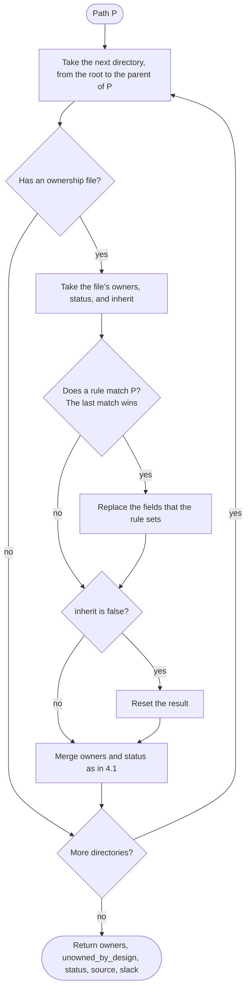

# The owners.yaml format

Version: 1
Status: stable

This document defines the `owners.yaml` file format and how a tool resolves the owner of a path from it.
`owners-yaml` is the reference implementation.
A JSON Schema for editors is in [`owners.schema.json`](https://github.com/PostHog/posthog/blob/master/tools/owners/owners.schema.json).

The key words "MUST", "MUST NOT", "REQUIRED", "SHALL", "SHALL NOT", "SHOULD", "SHOULD NOT", "RECOMMENDED", "NOT RECOMMENDED", "MAY", and "OPTIONAL" in this document are to be interpreted as described in BCP 14 [RFC 2119](https://www.rfc-editor.org/rfc/rfc2119) [RFC 8174](https://www.rfc-editor.org/rfc/rfc8174) when, and only when, they appear in all capitals, as shown here.

## 1. Terminology

- **Repository**: the tree of files that ownership covers. Paths are relative to its root and use `/` as the separator.
- **Ownership file**: a file named `owners.yaml`, or an alias file (section 6).
- **Root file**: the ownership file in the repository root.
- **Owner**: a team slug, such as `team-billing`, or a person handle, such as `@alice`. A person handle starts with `@`.
- **Primary owner**: the first entry of a resolved owners list.
- **Rule**: an entry of `rules:` that overrides fields for the paths its pattern matches.
- **Resolution**: the result of the algorithm in section 4 for one path.
- **Unowned**: a path whose resolution has no owners and is not unowned by design.
- **Unowned by design**: a path whose resolution comes from an explicit `owners: null`.

## 2. File placement

1. An ownership file applies to the directory that contains it and to everything below that directory.
2. A directory MUST NOT contain more than one ownership file.
3. A tool MUST read only the file named `owners.yaml` and the alias files the root file declares (section 6). It MUST NOT read other file names as ownership files.
4. An `owners.yaml` MUST NOT be placed in a directory where other tooling reads every YAML file. `.github/workflows/` and its subdirectories are always reserved. The root file MAY reserve more locations with `reserved_dirs` (section 5).

## 3. Fields

An ownership file is a YAML mapping.

| Field     | Required | Type                               | Meaning                                                                       |
| --------- | -------- | ---------------------------------- | ----------------------------------------------------------------------------- |
| `version` | yes      | integer                            | The format version. MUST be the integer `1`, not a boolean, float, or string. |
| `owners`  | yes      | string, list of strings, or `null` | The owners of the directory.                                                  |
| `status`  | no       | string                             | The lifecycle of the code.                                                    |
| `inherit` | no       | boolean                            | Whether fields fall through from ancestor files. Default `true`.              |
| `rules`   | no       | list of rule mappings              | Per-path overrides inside this directory.                                     |

The root file MAY also carry the repository settings in section 5.
Any other top-level field is an error.

### 3.1 `owners`

1. A string is a list with one entry.
2. Each entry MUST be a non-empty string.
3. A list MUST be ordered. The first entry is the primary owner.
4. `null` means the directory is unowned by design. A coverage check MUST NOT report such paths.
5. An empty list means the file sets no owners. The owners of the nearest ancestor apply.
6. Any other value is an error. The file then sets no owners, as with an empty list, and its other fields still apply.

### 3.2 `status`

The value MUST be one of these:

| Value        | Meaning                                                                 |
| ------------ | ----------------------------------------------------------------------- |
| `active`     | Maintained code. This is the default.                                   |
| `deprecated` | Code that is due for removal.                                           |
| `generated`  | Output of a generator. A review tool SHOULD NOT request reviews for it. |
| `vendored`   | Third-party code copied into the repository.                            |

### 3.3 `inherit`

`inherit: false` discards everything that ancestor files contributed, for every path the file applies to.
A rule MAY set `inherit` to change this for the paths it matches.

### 3.4 `rules`

Each rule is a mapping with these fields:

| Field     | Required | Type                                | Meaning                                               |
| --------- | -------- | ----------------------------------- | ----------------------------------------------------- |
| `match`   | yes      | string or non-empty list of strings | Patterns, relative to the directory of the file.      |
| `owners`  | no       | as in 3.1                           | Replaces the file-level owners for matching paths.    |
| `status`  | no       | as in 3.2                           | Replaces the file-level status for matching paths.    |
| `inherit` | no       | boolean                             | Replaces the file-level `inherit` for matching paths. |

1. A rule with a list of valid patterns is equal to one rule per pattern, in list order, with the same fields.
2. Within one file, the last rule whose pattern matches a path applies. Earlier matching rules have no effect.
3. A rule MUST NOT change the resolution of a path outside the directory of its file.
4. A rule with a pattern that the matcher rejects is an error. A tool MUST ignore the whole rule, including its other patterns, and MAY continue with the rest of the file.

### 3.5 Patterns

Patterns use the GitHub CODEOWNERS syntax, applied to paths relative to the directory of the file:

1. A pattern that starts with `/` is anchored to that directory.
2. A pattern with no `/`, or with only a trailing `/`, matches at any depth.
3. A pattern that contains a `/` other than at the end is anchored to that directory.
4. A trailing `/` matches the directory and everything below it.
5. A pattern whose last segment has no wildcard also matches everything below a directory of that name.
6. `*` matches any characters except `/`. `?` matches one character except `/`. `**` matches zero or more directories.
7. `\` escapes the next character.
8. A pattern MUST NOT be empty and MUST NOT contain `***`.

## 4. Resolution

A consumer SHOULD get resolutions from an implementation of this algorithm, not by reading ownership files itself.

To resolve a path `P`:

1. Normalize `P`: replace `\` with `/`, then remove any leading `./` and `/`.
2. List the directories from the repository root down to the parent directory of `P`, root first.
3. For each directory, find its ownership file. Skip the directory when it has none. A file that is not a YAML mapping, or that lacks `version: 1` or `owners`, counts as absent.
4. Start with an empty result: owners unset, status unset, source unset.
5. For each file found in step 3, in order:
   1. Take the file-level `owners`, `status`, and `inherit`.
   2. Find the last rule in the file that matches `P` (section 3.4). If one matches, replace each field that the rule sets.
   3. If `inherit` is `false`, reset the result to empty.
   4. If `owners` is `null`, set the result owners to `null` and the source to this file.
   5. If `owners` is a non-empty list, set the result owners to that list and the source to this file.
   6. If `status` is set, set the result status to it.
6. Return the resolution:
   - `owners`: the result owners, or an empty list when unset or `null`.
   - `unowned_by_design`: `true` when the result owners are `null`.
   - `status`: the result status, or `active` when unset.
   - `source`: the path of the file that set the owners, or none.
   - `slack`: the channel from section 5.2, for the requested purpose.

A path is unowned when `owners` is empty and `unowned_by_design` is `false`.

### 4.1 Field merge

Step 5 applies each file's values to the result as this table shows.
The value is the file-level value after the matching rule replaced it.

| Field     | Value in the file | Effect on the result                                                |
| --------- | ----------------- | ------------------------------------------------------------------- |
| `inherit` | `false`           | The result is reset to empty before the other fields apply.         |
| `inherit` | `true` or absent  | No effect.                                                          |
| `owners`  | non-empty list    | Owners become this list. Source becomes this file.                  |
| `owners`  | `[]`              | No effect.                                                          |
| `owners`  | `null`            | Owners become `null` (unowned by design). Source becomes this file. |
| `status`  | set               | Status becomes this value.                                          |
| `status`  | absent            | No effect.                                                          |

### 4.2 Flow (non-normative)

The numbered steps above are normative. This diagram shows the same walk.



### 4.3 Conformance

The cases in [`conformance/`](https://github.com/PostHog/posthog/tree/master/tools/owners/conformance) are part of this specification.
An implementation of section 4 and section 5.2 MUST produce the expected result for every case that applies to it.
When the prose and a case disagree, the disagreement is a defect in this specification.

## 5. Repository settings

Only the root file MAY carry these fields. A tool MUST report them as errors in any other file.

| Field           | Type             | Meaning                                                                                                   |
| --------------- | ---------------- | --------------------------------------------------------------------------------------------------------- |
| `teams`         | mapping          | The team channel registry (section 5.2).                                                                  |
| `github_org`    | string           | The GitHub organization of the team slugs.                                                                |
| `producers`     | list of strings  | The automation names a team can address in `notifications`.                                               |
| `reserved_dirs` | list of patterns | Extra locations where `owners.yaml` MUST NOT be placed. The patterns are relative to the repository root. |
| `alias_files`   | list of strings  | The other file names that count as ownership files (section 6).                                           |
| `codeowners`    | mapping          | How a CODEOWNERS export spells test file paths. This field is specific to `owners-yaml` (section 8).      |

### 5.1 `github_org`

1. A tool that converts a team slug to a GitHub team MUST use the handle `@<github_org>/<slug>`.
2. The value MUST NOT contain `/`.
3. A tool MAY accept an override on its command line.

### 5.2 Team channels

`teams` maps a team slug to a mapping with these OPTIONAL fields:

| Field           | Type                                                             | Meaning                        |
| --------------- | ---------------------------------------------------------------- | ------------------------------ |
| `slack`         | channel or `false`                                               | Where people on the team talk. |
| `notifications` | channel, `false`, or a mapping of producer to channel or `false` | Where automation posts.        |

1. A channel is a string that starts with `#`.
2. `false` means the team has no channel for that purpose.
3. A key of `teams` MUST be a team slug. It MUST NOT be a person handle.
4. When the root file declares `producers`, each key of a `notifications` mapping MUST be in that list. When it does not, any non-empty name is valid.
5. A tool that cannot read a `notifications` mapping SHOULD treat it as `false`, so a typo silences automation instead of posting to an unwanted channel.

To find the channel for a team slug `T`, a purpose, and an optional producer:

1. If `T` has no entry in `teams`, return `#T`. The result is derived, not declared.
2. For the purpose "people", check `slack`.
3. For the purpose "notifications", check `notifications` first, then `slack`.
4. When the checked value is a mapping, take the value for the producer. With no producer, or when the mapping does not name it, move to the next field.
5. When the checked value is a channel, return it. When it is `false`, return no channel. Both results are declared.
6. When no field gives a value, return `#T` as a derived result.

The channel of a path is the channel of its primary owner.
When the primary owner is a person handle, the path has no channel.

## 6. Alias files

An alias file is a file with another name that a tool reads as an ownership file, such as a package manifest that already lists owners.
The root file declares the alias files in `alias_files` (section 5).

1. Each entry of `alias_files` MUST be a bare file name. It MUST NOT contain `/`.
2. An entry MUST NOT be `owners.yaml`.
3. A tool MUST NOT read a file as an ownership file unless the file is named `owners.yaml` or the root file declares its name in `alias_files`.
4. A tool MUST read only the `owners` field of an alias file. All other fields have no effect on ownership.
5. The `owners` field MUST be a list of non-empty strings. Otherwise the file counts as absent.
6. An `owners.yaml` in the same directory takes precedence. A linter SHOULD report a directory that has both.
7. When a directory holds more than one alias file, the first name in `alias_files` decides.
8. An alias file in the repository root has no effect. The names come from the root `owners.yaml`, and that file takes precedence over any alias file next to it.

A repository with no root file, or with no `alias_files`, has no alias files. Only `owners.yaml` decides ownership there.

## 7. Resolver interface

This section applies to an implementation that answers resolution requests from other programs through a command.
In `owners-yaml`, both `owners resolve --json` and `python -m owners_yaml` implement it.

### 7.1 Request

1. The caller MAY pass paths as command arguments.
2. When the caller passes no path arguments, the resolver MUST read paths from standard input, one path per line. It MUST remove whitespace at the start and end of each line and MUST skip empty lines.
3. The caller MAY name the repository root. Without one, the resolver MAY find the root itself, for example from the git worktree.
4. The caller MAY name the purpose of the channel: people or notifications (section 5.2). The default is people. `owners-yaml` spells these `--purpose slack` and `--purpose notifications`.

### 7.2 Response

1. On success, the resolver MUST write one JSON object to standard output and exit with status 0.
2. Each key MUST be a requested path after normalization (section 4, step 1). Two requests that normalize to the same path produce one key.
3. Each value MUST be an object with these members:

   | Member   | Type             | Value                                                                     |
   | -------- | ---------------- | ------------------------------------------------------------------------- |
   | `owners` | array of strings | The resolved owners. Empty when the path is unowned or unowned by design. |
   | `status` | string           | The resolved status.                                                      |
   | `slack`  | string or `null` | The channel for the requested purpose.                                    |
   | `source` | string or `null` | The repository-relative path of the file that set the owners.             |

4. A path that is unowned by design has an empty `owners` array and a non-null `source`. An unowned path has an empty `owners` array and a `null` source.
5. An unowned path is not an error.

[`resolution.schema.json`](https://github.com/PostHog/posthog/blob/master/tools/owners/resolution.schema.json) describes this object.

### 7.3 Errors

1. When the repository root does not exist or cannot be found, the resolver MUST exit with a non-zero status.
2. On an error, the resolver MUST NOT write a partial response to standard output.

### 7.4 Compatibility

1. A consumer MUST ignore members that it does not know.
2. An implementation MAY add members to a value.
3. Removing a member, renaming it, or changing its meaning requires a new version of this specification.
4. For the Python library, the names exported from the top-level `owners_yaml` package are the public API. Submodules can change between minor releases.

## 8. The owners-yaml reference implementation

This section describes the reference implementation. It is not part of the format.

- It reads the alias files the root `owners.yaml` declares. PostHog's own repository declares `product.yaml`.
- It removes the placeholder owner `team-CHANGEME` from every owners list.
- Its linter reports schema errors, reserved locations, directories with both an `owners.yaml` and an alias file, rule patterns that match no tracked file, and the number of unowned files. With `--live`, it also checks team slugs and person handles against the GitHub organization.
- Its CODEOWNERS export covers test files only: `test_*.py` and `*_test.py` for pytest, and `*.test.*` or `*.spec.*` with a `.js`, `.jsx`, `.ts`, or `.tsx` extension for Jest. The `codeowners` setting accepts these keys:

  | Key                  | Meaning                                                                                                                                          |
  | -------------------- | ------------------------------------------------------------------------------------------------------------------------------------------------ |
  | `jest_root`          | A directory whose Jest suite runs the tests of other packages.                                                                                   |
  | `jest_root_tests`    | A pattern, relative to the repository root, for the test files that `jest_root` runs. Those files get an extra spelling relative to `jest_root`. |
  | `jest_root_packages` | A directory whose packages do not run their own Jest suite, so their files get no package-relative spelling.                                     |

## 9. Examples (non-normative)

The smallest valid file:

```yaml
version: 1
owners: team-billing
```

A file with every directory-level field:

```yaml
version: 1
owners: [team-billing, '@alice']
status: active
inherit: true
rules:
  - match: 'generated/**'
    status: generated
  - match: 'vendor/'
    status: vendored
    owners: null
  - match: ['migrations/', 'legacy/']
    owners: [team-billing, team-data]
```

A root file with repository settings:

```yaml
version: 1
owners: []
github_org: acme
producers: [review-bot, deploy-bot]
reserved_dirs: ['services/*/openapi/**']
alias_files: [package.yaml]
teams:
  team-billing:
    slack: '#billing'
    notifications:
      review-bot: '#billing-reviews'
      deploy-bot: false
  team-legacy:
    slack: false
```

A worked example. The repository has three ownership files:

```yaml
# owners.yaml
version: 1
owners: team-platform
status: active
teams:
  team-billing:
    notifications: '#billing-bots'
```

```yaml
# billing/owners.yaml
version: 1
owners: [team-billing, '@alice']
status: deprecated
rules:
  - match: 'api/'
    status: active
  - match: 'vendor/'
    owners: null
```

```yaml
# billing/legacy/owners.yaml
version: 1
owners: []
inherit: false
```

The trace for `billing/api/invoices.py`:

| Step | File                  | Values after the rule                                                 | Result after the step                                                          |
| ---- | --------------------- | --------------------------------------------------------------------- | ------------------------------------------------------------------------------ |
| 1    | `owners.yaml`         | owners `[team-platform]`, status `active`                             | owners `[team-platform]`, status `active`, source `owners.yaml`                |
| 2    | `billing/owners.yaml` | rule `api/` matches: owners `[team-billing, @alice]`, status `active` | owners `[team-billing, @alice]`, status `active`, source `billing/owners.yaml` |

The primary owner is `team-billing`. Its registry entry has no `slack`, so the people channel is the derived `#team-billing`. The notifications channel is `#billing-bots`.

The results for all four paths, with the purpose "people":

| Path                      | `owners`                 | `unowned_by_design` | `status`     | `source`              | `slack`         |
| ------------------------- | ------------------------ | ------------------- | ------------ | --------------------- | --------------- |
| `billing/api/invoices.py` | `[team-billing, @alice]` | `false`             | `active`     | `billing/owners.yaml` | `#team-billing` |
| `billing/jobs/run.py`     | `[team-billing, @alice]` | `false`             | `deprecated` | `billing/owners.yaml` | `#team-billing` |
| `billing/vendor/lib.py`   | `[]`                     | `true`              | `deprecated` | `billing/owners.yaml` | none            |
| `billing/legacy/old.py`   | `[]`                     | `false`             | `active`     | none                  | none            |

`billing/legacy/old.py` is unowned: `inherit: false` drops everything from the parent files, and the file itself sets no owners. The status is the default, `active`.

Invalid files:

```yaml
# Missing `version`: the file counts as absent.
owners: team-billing
```

```yaml
# `teams` outside the root file is an error.
version: 1
owners: team-billing
teams:
  team-billing:
    slack: '#billing'
```

```yaml
# `***` is not a valid pattern, so the rule is ignored.
version: 1
owners: team-billing
rules:
  - match: 'a***b'
    owners: team-other
```

## 10. Design notes (non-normative)

- **Nearest file wins, per field.** Kubernetes OWNERS files add approvers from every ancestor, which fits "someone must approve". For routing, the union tags too many teams, so the nearest file wins. The merge is per field, so a child file that sets only `owners` keeps the `status` of its ancestors.
- **Rules stay in their file.** In a single CODEOWNERS file, a broad pattern added late can take over earlier specific lines. Here a rule changes only its own directory, so a new rule cannot take over paths in another directory.
- **Unowned is a decision.** `owners: null` records that nobody owns a path on purpose. A missing owner fails the coverage check.
- **Routing, not approval.** The format answers "who owns this path" for review requests, alerts, and reports. It does not replace a platform's required-approval rules.

## Changelog

- **1** (2026-09): First published version.
